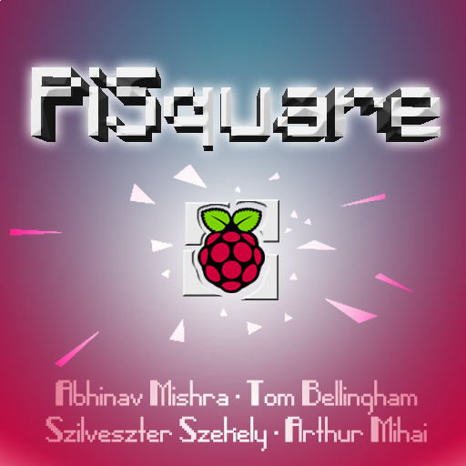
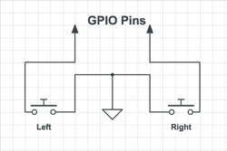
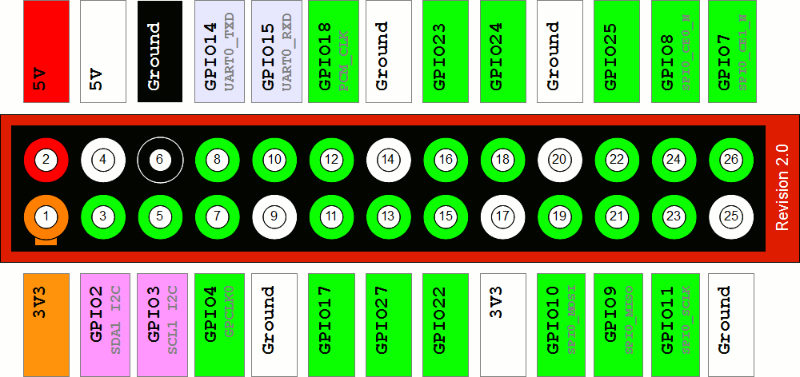

PiSquare
========

Real-time multiplayer arcade mini-game. Steer to avoid moving obstacles and
outlast your opponents

Written in bare metal C. Built for Raspberry Pi 1B.

Dependencies
------------

Please install the following utils before building the game.

1. make
2. sed
3. arm-none-eabi- toolchain

After you have installed them do ``make``

Controller Design
-----------------

| Player Number   | Right Pin   | Left Pin |
|-----------------|-------------|----------|
| 1               | 4           | 7        |
| 2               | 2           | 3        |
| 3               | 10          | 9        |
| 4               | 8           | 14       |

Contributors
------------

1. Abhinav Mishra
	- abhinav.mishra15@imperial.ac.uk

2. Arthur-Mihai Niculae
	- arthur-mihai.niculae15@imperial.ac.uk

3. Szilveszter Szekely
	- szilveszter.szekely15@imperial.ac.uk

4. Tom Bellingham
	- tom.bellingham15@imperial.ac.uk

Acknowledgements
----------------

1. **Cambridge University Tutorials** for Baking Pi Operating Systems Development.
2. **Valvers[dot]com** for Bare Metal Programming in C.
3. **Brian Sidebotham** for Raspberry Pi Baremetal Libraries.
4. **Linux Devs** for checkpatch[dot]pl utility
5. **PiFox Team** for imager[dot]py utility.
6. **Richard Hipp** for makeheaders utility.
